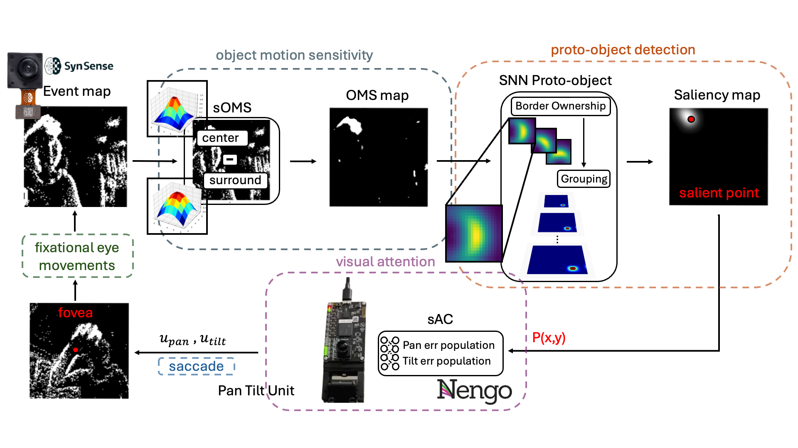

# Wandering Around: A Bioinspired Approach to Foveation Through Object Motion Sensitivity

**Authors:**  
Giulia D’Angelo1,*, Victoria Clerico2, Chiara Bartolozzi3, Matej Hoffmann1, P. Michael Furlong4, Alexander Hadjiivanov5  

---

**Affiliations:**  
1. Department of Cybernetics, Faculty of Electrical Engineering, Czech Technical University, Prague, Czech Republic  
2. IBM Research Europe, Zurich, Switzerland  
3. Event-Driven Perception for Robotics, Italian Institute of Technology, Genoa, Italy  
4. National Research Council of Canada & Systems Design Engineering, University of Waterloo, Canada  
5. The Netherlands eScience Center, Netherlands  

---

**Corresponding Author:**  
Giulia D’Angelo – [giulia.dangelo@fel.cvut.cz](mailto:giulia.dangelo@fel.cvut.cz)

---

## YouTube Video Demonstration:

## Abstract

Active vision provides a dynamic and robust approach to visual perception, presenting a compelling alternative for robotics to the static and passive nature of feedforward architectures commonly employed in state-of-the-art computer vision. Traditional approaches often rely on training large datasets and demand significant computational resources. Selective attention mechanisms, inspired by biological mechanisms, allow agents to focus on salient areas within their visual field, processing only Regions of Interest (ROIs). This targeted approach significantly reduces computational demand while preserving real-time responsiveness.
Event-based cameras, inspired by the mammalian retina, further enhance this capability by capturing asynchronous changes in a scene, facilitating efficient, low-latency visual processing. To distinguish moving objects while the event-based camera is also in motion within a dynamic scene, the agent requires an object motion segmentation mechanism to accurately detect targets and position them at the center of the visual field (the fovea) through saccadic movements.
Integrating event-based sensors with neuromorphic algorithms represents a paradigm shift, using Spiking Neural Networks (SNNs) to parallelize computation and adapt to dynamic environments. This work presents a Spiking Convolutional Neural Network (sCNN) bioinspired attention system for selective attention through object motion sensitivity
The system generates events through fixational eye movements using a Dynamic Vision Sensor (DVS) integrated into the Speck neuromorphic hardware, mounted on a Pan-Tilt unit, to identify the region of interest (ROI) and then performs a saccade to shift the fovea toward it
The system, characterised using ideal gratings and benchmarked against the Event Camera Motion Segmentation Dataset (EVIMO), achieves a mean Intersection over Union (IoU) of 82.2\% and a mean Structural Similarity Index Measure (SSIM) of 96\% in multi-object motion segmentation. Additionally, it reaches an object detection accuracy of 88.8\% in office scenarios and 89.8\% in challenging indoor and outdoor low-light conditions, as evaluated on the Event-Assisted Low-Light Video Object Segmentation Dataset (LLE-VOS). 
A real-time demonstrator showcases the system's capabilities of detecting salient objects through object motion sensitivity in $0.04$ s in dynamic scenes.
Its learning-free design ensures robustness across diverse perceptual scenes, making it a reliable foundation for real-time robotic applications and serving as a basis for more complex architectures.
